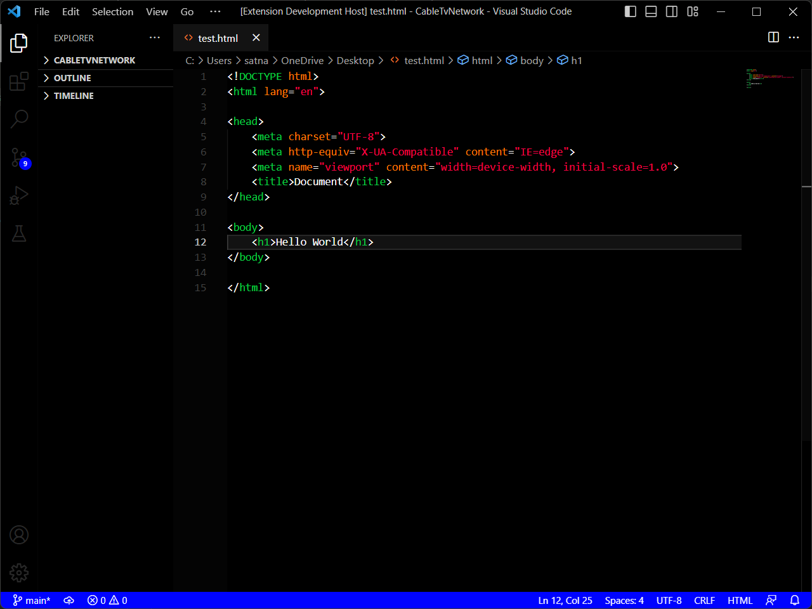

# DarkerBlack VSCode Theme by Satnam Singh
DarkerBlack is a Visual Studio Code theme designed to provide a sleek, modern and easy-to-read coding experience. It features a darker background with high-contrast syntax highlighting, making it suitable for long coding sessions.

## Preview

## Installation
To install the DarkerBlack theme, follow these steps:

1. Open Visual Studio Code
1. Click on the "Extensions" icon on the left-hand side of the window (it looks like four squares connected by lines)
1. Search for "DarkerBlack" in the search bar
1. Click the "Install" button next to the DarkerBlack theme
1. Once the installation is complete, click the "Reload" button to activate the theme

## Features
Some of the key features of the DarkerBlack theme include:

* High contrast syntax highlighting for easy readability
* Darker background for reduced eye strain during long coding sessions
* Consistent color scheme across different programming languages
* Minimalistic design to reduce distractions and improve focus
* Support for popular programming languages and file types

## Customization
The DarkerBlack theme also allows for some customization, including:

* Adjusting the font size and family
* Changing the background color
* Changing the color of specific syntax elements
To customize the theme, go to the "File" menu and select "Preferences" > "Color Theme". From there, you can select the DarkerBlack theme and customize it to your liking.

## Conclusion
If you're looking for a sleek and easy-to-read Visual Studio Code theme, DarkerBlack by Satnam Singh is definitely worth a try. With its high contrast syntax highlighting, minimalistic design, and customization options, it's a great choice for developers who spend long hours coding.